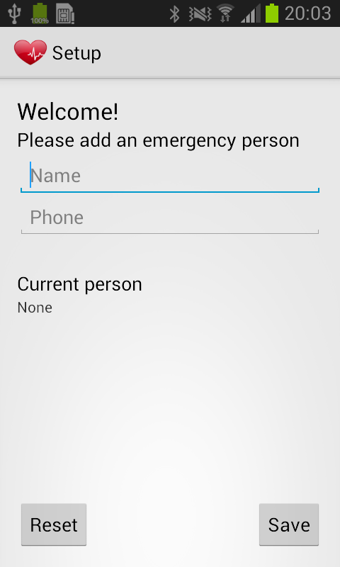
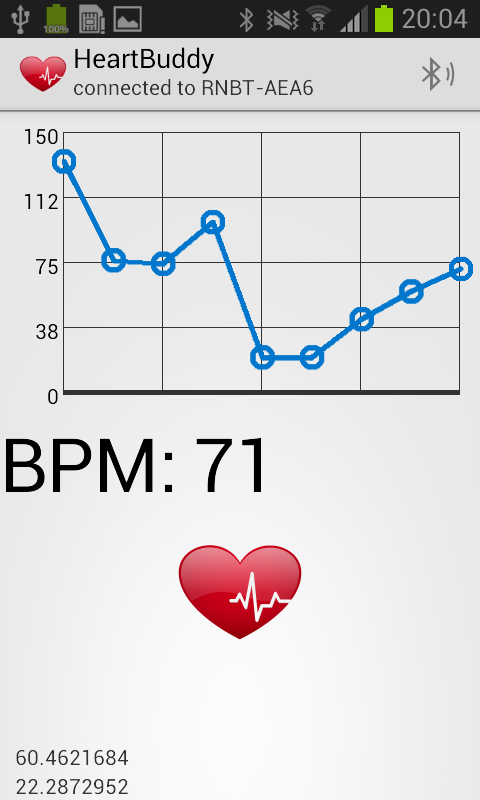

HeartBuddy
==========

This project has been developed for the [Cyber Physical System course](https://nettiopsu.utu.fi/opas/teaching/course.htm?id=9492) at the [University of Turku](www.utu.fi).

Introduction
------------
During the mentioned course, we were introduced to microcontroller boards like [Arduino Uno](https://www.arduino.cc/en/main/arduinoBoardUno), and were assigned the task of a practical project that needs to include some kind of wireless communication, preferably related to health care.  

Our group decided to create HeartBuddy, a Arduino Uno based device that monitors the heart rate of a person and triggers emergency messages via bluetooth on a connected Android phone. This means that the project consists of two parts:

* The device itself called HeartEmergencyKit: [Source](https://github.com/Clabfabs/HeartEmergencyKit)
* An Android application to handle the transmitted data (this repo)

If the Android application is connected to the device, it will constantly receive & display the heart rate and emergency notifications, after which the Android phone sends a text message with the current heart rate and geolocation information to pre-defined care givers.   

Basis
-----
This code is based on the Android bluetooth chat code sample [android-BluetoothChat](https://github.com/googlesamples/android-BluetoothChat), which brings most of the bluetooth communication related functionality.

Pre-requisites
--------------

- Android SDK v23
- Android Build Tools v23.0.2
- Android Support Repository

Screenshots
-------------

  

Getting Started
---------------

This sample uses the Gradle build system. To build this project, use the "gradlew build" command or use "Import Project" in Android Studio.

